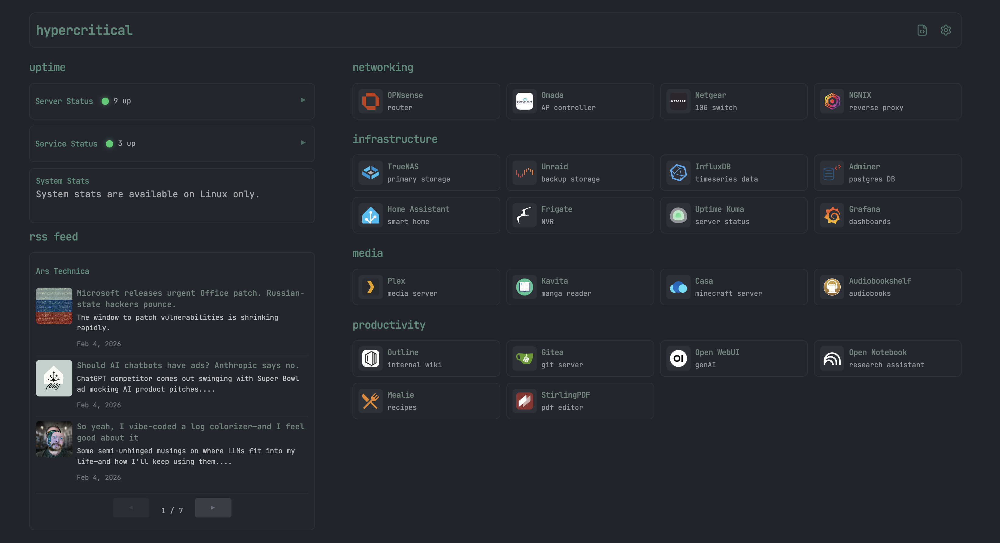

# Statis

A lightweight, self-hosted dashboard for your homelab services. Built with Go and Skeleton CSS for minimal resource usage.



## Features

- 🪶 **Lightweight** - Single binary, ~10MB memory usage
- ⚙️ **Configurable** - YAML config file or web UI
- 🎨 **Themeable** - Customize colors via config
- 📱 **Responsive** - Works on mobile and desktop
- 🔌 **Widgets** - Uptime Kuma, iFrame, Clock (extensible)
- 🐳 **Docker Ready** - Easy deployment

## Quick Start

### Option 1: Docker Compose (Recommended)

```bash
# Clone or download
git clone https://github.com/hyhenry/statis.git
cd statis

# Edit config
cp config.yaml.example config.yaml
nano config.yaml

# Run
docker-compose up -d
```

### Option 2: Go Binary

```bash
# Build
go build -o statis .

# Run
./statis
```

### Option 3: Build from Source

```bash
# Install dependencies
go mod download

# Run in development
go run .
```

Access the dashboard at `http://localhost:8080`

## Configuration

Edit `config.yaml` or use the web UI at `/settings`.

### Basic Structure

```yaml
title: "My Homelab"
subtitle: "Welcome home"

theme:
  primary_color: "#33C3F0"
  background_color: "#1a1a2e"
  card_color: "#16213e"
  text_color: "#eaeaea"

services:
  - name: "Section Name"
    items:
      - name: "Service Name"
        url: "https://service.local"
        icon_text: "🖥️"           # Emoji icon
        # icon: "https://..."     # Or URL to image
        description: "Description"
        target: "_blank"          # Optional: _blank, _self

widgets:
  - type: "uptime-kuma"
    title: "Service Status"
    config:
      url: "https://uptime.local:3001"
      slug: "status"
```

### Icons

You can use either:
- **Emoji**: `icon_text: "🖥️"`
- **Image URL**: `icon: "https://cdn.jsdelivr.net/gh/walkxcode/dashboard-icons/png/proxmox.png"`

Dashboard Icons collection: https://github.com/walkxcode/dashboard-icons

### Available Widgets

#### Uptime Kuma
```yaml
- type: "uptime-kuma"
  title: "Service Status"
  config:
    url: "https://your-uptime-kuma-instance"
    slug: "your-status-page-slug"
```

#### Clock
```yaml
- type: "clock"
  title: "Local Time"
  config:
    timezone: "local"  # Or "America/New_York", "Europe/London", etc.
    format: "24h"      # Or "12h"
```

#### iFrame
```yaml
- type: "iframe"
  title: "Embedded Page"
  config:
    url: "https://example.com"
    height: "300px"
```

## Environment Variables

| Variable | Default | Description |
|----------|---------|-------------|
| `PORT` | `8080` | HTTP port |
| `CONFIG_PATH` | `./config.yaml` | Path to config file |

## Reverse Proxy

### Nginx
```nginx
location / {
    proxy_pass http://localhost:8080;
    proxy_set_header Host $host;
    proxy_set_header X-Real-IP $remote_addr;
}
```

### Traefik (Docker labels)
```yaml
labels:
  - "traefik.enable=true"
  - "traefik.http.routers.statis.rule=Host(`dash.yourdomain.com`)"
```

## Development

### Project Structure
```
statis/
├── main.go              # Main application
├── config.yaml          # Configuration
├── templates/
│   ├── index.html       # Dashboard page
│   └── settings.html    # Settings page
├── static/
│   ├── css/
│   │   ├── normalize.css
│   │   ├── skeleton.css
│   │   └── custom.css
│   └── js/
│       ├── widgets.js
│       └── settings.js
├── Dockerfile
└── docker-compose.yaml
```

### Adding Widgets

1. Add handler function in `main.go` (for widgets that need a proxy)
2. Add initialization in `static/js/widgets.js`
3. Add to widget type dropdown in `static/js/settings.js`

## API Endpoints

| Endpoint | Method | Description |
|----------|--------|-------------|
| `/` | GET | Dashboard |
| `/settings` | GET | Settings page |
| `/api/config` | GET | Get current config |
| `/api/config` | PUT | Update config |
| `/api/widget/uptime-kuma` | GET | Proxy to Uptime Kuma |
| `/api/widget/system-stats` | GET | Local CPU/RAM usage (Linux only) |

## Comparison

| Feature | Statis | Dashy | Homer |
|---------|--------------|-------|-------|
| Binary Size | ~8MB | N/A | N/A |
| Memory Usage | ~10MB | ~100MB+ | ~50MB+ |
| Config | YAML + UI | YAML + UI | YAML |
| Widgets | ✓ | ✓✓✓ | Limited |
| Themes | ✓ | ✓✓✓ | ✓ |
| Dependencies | None | Node.js | Node.js |

## License

MIT License - feel free to use, modify, and distribute.

## Contributing

Pull requests welcome! Please keep the lightweight philosophy in mind.
